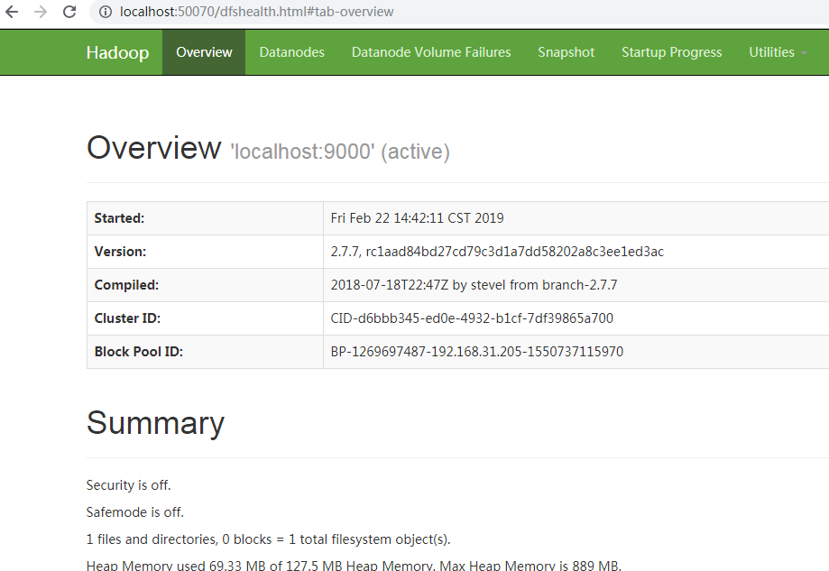

## 一. Hadoop2.7.7源码编译 ###
 如果想整体编译Hadoop源码，需要大费一番周折，因为我只想分析HDFS和Yarn相关的源码，所以我只下载了相关的模块代码，其他代码都是从Maven库中获取
 
### 整体编译需求 ###
Windows系统下，如果想要整体编译，那么需要安装以下组件
* JDK 1.7+
* Maven 3.0 or later
* Findbugs 1.3.9 (if running findbugs)
* ProtocolBuffer 2.5.0 (windows 下安装 protoc-2.5.0-win32，会用到protoc.exe文件)
* CMake 2.6 or newer (if compiling native code), must be 3.0 or newer on Mac
* VS2010(主要用来编译c代码的，会用到msbuild.exe文件)
* ANT

### 简单编译需求 ###
整体编译需要安装的组件太多了，我这里就像分析下代码，所以就采取了简单的编译策略，只编译Protoc序列化文件，不编译c代码
* JDK 1.7+
* Maven 3.0 or later
* protoc-2.5.0-win32.zip(解压后将protoc.exe文件拷贝到java环境的bin下，或者配置到path环境变量中)
* 注释掉所有pom.xml中 maven-antrun-plugin插件中涉及到编译c语言代码的配置
* Maven镜像最好用中心库，否则有一些test-jar无法下载
 ###### hadoop-hdfs中pom.xml这个插件注释掉，注释的时候要注意，他有多个编译目标，注释掉默认的即可
       <plugin>
         <groupId>org.apache.maven.plugins</groupId>
         <artifactId>maven-antrun-plugin</artifactId>
         <executions>
           <execution>
        <id>make</id>
        <phase>compile</phase>
        <goals>
          <goal>run</goal>
        </goals>
        <configuration>
          <target>
            <condition property="generator" value="Visual Studio 10" else="Visual Studio 10 Win64">
              <equals arg1="Win32" arg2="${env.PLATFORM}" />
            </condition>
            <mkdir dir="${project.build.directory}/native"/>
             .......
          </target>
        </configuration>
           </execution>
          ......
         </executions>
       </plugin>
  ###### hadoop-common模块中pom.xml以下配注释掉，可以看到是用来编译winutils.exe文件的
       <plugin>
         <groupId>org.codehaus.mojo</groupId>
         <artifactId>exec-maven-plugin</artifactId>
         <executions>
           <execution>
             <id>compile-ms-winutils</id>
             <phase>compile</phase>
             <goals>
               <goal>exec</goal>
             </goals>
             <configuration>
               <executable>msbuild</executable>
               <arguments>
                 <argument>${basedir}/src/main/winutils/winutils.sln</argument>
                 <argument>/nologo</argument>
                 <argument>/p:Configuration=Release</argument>
                 <argument>/p:OutDir=${project.build.directory}/bin/</argument>
                 <argument>/p:IntermediateOutputPath=${project.build.directory}/winutils/</argument>
                 <argument>/p:WsceConfigDir=${wsce.config.dir}</argument>
                 <argument>/p:WsceConfigFile=${wsce.config.file}</argument>
               </arguments>
             </configuration>
           </execution>
            ......
         </executions>
       </plugin>
       
  ###### 修改protoc源码的输出路径
  Hadoop源码想要运行起来，坑实在太多了，用插件生成的protoc源码默认是存放在编译路径下，
  这样用IDEA等工具查看源码时，protoc代码肯定是找不见的，所以需要修改下pom.xml文件中
  源码输出路径，不知道那些Hadoop项目组的大神们平时是怎么开发的     
    
    我是专门用个工程来存放protoc序列化生成的代码，然后用到protoc序列化的工程引入这个工程
    将这种路径
    <output>${project.build.directory}/generated-sources/java</output>
    改成
    <output>${user.dir}/hadoop-protoc/src/main/java</output>

### 编译 ### 
     mvn clean package -Dmaven.test.skip=true  -X  
     
#### 整体编译结果 ###    
    1. 编译后会生成protoc序列化代码
    2.windows
      hadoop.dll
      winutils.exe
    3.linux
      hadoop.lib
      libwinutils.lib
    4. 描述文件
      hadoop.exp
      hadoop.pdb
      winutils.pdb
    其中windows环境中会用到  hadoop.dll、winutils.exe
    这个是整体编译c语言代码生成可执行文件，我这里因为不编译c语言，所以这些程序只能从网上下载了。
    
    已经有大神帮我们编译好了，去里面按照你需要的版本下载：
    https://github.com/steveloughran/winutils
 
## 二. 安装 ###

前面说了编译，下面说说如何安装和启动Hadoop

### 环境 ###
    windows 7-64bit
    jdk-1.8.0_161
    hadoop-2.7.7

#### 注意
    如果JDK安装在Program Files目录下，因为中间有空格，所以启动时会报“JAVA_HOME is incorrect”， 
    直接将Program Files替换为Progra~1即可，或者修改hadoop-evn.cmd文件中JAVA_HOME配置
 
### 安装配置hadoop
#### 1、下载hadoop-2.7.7的tar包
http://hadoop.apache.org/
https://mirrors.tuna.tsinghua.edu.cn/apache/hadoop/common

#### 2、解压并配置环境变量
    复制到D盘根目录直接解压，出来一个目录D:\hadoop-2.7.1，配置到环境变量HADOOP_HOME中
    在PATH里加上%HADOOP_HOME%\bin;

#### 3、下载windows专用二进制文件和工具类依赖库,[下载地址]( https://github.com/steveloughran/winutils)
    hadoop在windows上运行需要winutils支持和hadoop.dll等文件
    在github仓库中找到对应版本的二进制库hadoop.dll和winutils.exe文件，然后把文件拷贝到D:\hadoop-2.7.1\bin目录中去
    注意hadoop.dll等文件不要与hadoop冲突，若出现依赖性错误可以将hadoop.dll放到C:\Windows\System32下一份。

####  4、hadoop环境测试
 启动windows cmd命令行窗口执行hadoop version，显示如下：
     
     Hadoop 2.7.7
     Subversion Unknown -r c1aad84bd27cd79c3d1a7dd58202a8c3ee1ed3ac
     Compiled by stevel on 2018-07-18T22:47Z
     Compiled with protoc 2.5.0
     From source with checksum 792e15d20b12c74bd6f19a1fb886490
     This command was run using /D:/Work/IDE/hadoop-2.7.7/share/hadoop/common/hadoop-common-2.7.7.jar
    

#### 5、最小化配置hadoop伪集群
###### 去D:\hadoop-2.7.1\etc\hadoop找到下面4个文件并按如下最小配置粘贴上去：
###### core-site.xml，注意要修改hadoop.tmp.dir目录，以免数据丢失
    <configuration>
        <property>
            <name>fs.defaultFS</name>
            <value>hdfs://localhost:9000</value>
        </property>    
    	<property>
    		<name>hadoop.tmp.dir</name>
    		<value>/D:/hadoop-2.7.7/data</value>
    	</property>
    </configuration>

###### hdfs-site.xml (将value的路径改为自己的路径，盘符/d:/的前后都有正斜杠)
    <configuration>
        <property>
            <name>dfs.replication</name>
            <value>1</value>
        </property>
    </configuration>

###### mapred-site.xml (拷贝mapred-site.xml.template并改名)
    <configuration>
        <property>
            <name>mapreduce.framework.name</name>
            <value>yarn</value>
        </property>
    </configuration>

###### yarn-site.xml
    <configuration>
        <property>
            <name>yarn.nodemanager.aux-services</name>
            <value>mapreduce_shuffle</value>
        </property>
        <property>
            <name>yarn.nodemanager.aux-services.mapreduce.shuffle.class</name>
            <value>org.apache.hadoop.mapred.ShuffleHandler</value>
        </property>
    </configuration>

#### 6、格式化namenode并启动hadoop
    启动windows cmd命令行窗口执行hdfs namenode -format，待执行完毕没有报错即可，不需要重复format：

#### 启动
    start-dfs.cmd
    stop-dfs.cmd
    
    start-yarn.cmd
    stop-yarn.cmd
    
    start-all.cmd
    stop-all.cmd
 
### 查看hadoop状态 ###
 

 

## 三. 集群安装 ###

hadoop2.0已经发布了稳定版本了，增加了很多特性，比如HDFS HA、YARN等。最新的hadoop-2.4.1又增加了YARN HA
 
#### 1. 前期准备 
    #修改主机名和IP的映射关系
    #里面要配置的是内网IP地址和主机名的映射关系	
    /etc/hosts
    
    **切换用户时 .bash_profile中配置的环境变量不生效，切换用户时需要在su后面加“-”**
    su hadoop   //不生效
    su - hadoop //生效
    
    **Ubuntu系统中和centos好多地方都有区别**
    vi命令快捷键不一样
    配置环境变量不一样，乌班图是 ${JAVA_HOME}/bin:${PATH}，而centos中是$JAVA_HOME/bin:${PATH}
    
##### 关闭防火墙
 
    Ubuntu： 
    ufw enable
    ufw disable
    ufw status
    
    centos： 
    systemctl start firewalld.service #运行firewall
    systemctl stop firewalld.service #停止firewall
    systemctl disable firewalld.service #禁止firewall开机启动
    systemctl enable firewalld.service  #启用
    firewall-cmd --state #查看默认防火墙状态（关闭后显示notrunning，开启后显示running）
     

##### 集群规划：
	主机名		IP				安装的软件					运行的进程
	weekend01	192.168.1.201	jdk、hadoop					NameNode、DFSZKFailoverController(zkfc)
	weekend02	192.168.1.202	jdk、hadoop					NameNode、DFSZKFailoverController(zkfc)
	weekend03	192.168.1.203	jdk、hadoop					ResourceManager
	weekend04	192.168.1.204	jdk、hadoop					ResourceManager
	weekend05	192.168.1.205	jdk、hadoop、zookeeper		DataNode、NodeManager、JournalNode、QuorumPeerMain
	weekend06	192.168.1.206	jdk、hadoop、zookeeper		DataNode、NodeManager、JournalNode、QuorumPeerMain
	weekend07	192.168.1.207	jdk、hadoop、zookeeper		DataNode、NodeManager、JournalNode、QuorumPeerMain
	
##### 说明：
	1.在hadoop2.0中通常由两个NameNode组成，一个处于active状态，另一个处于standby状态。Active NameNode对外提供服务，而Standby NameNode则不对外提供服务，仅同步active namenode的状态，以便能够在它失败时快速进行切换。
	hadoop2.0官方提供了两种HDFS HA的解决方案，一种是NFS，另一种是QJM。这里我们使用简单的QJM。在该方案中，主备NameNode之间通过一组JournalNode同步元数据信息，一条数据只要成功写入多数JournalNode即认为写入成功。通常配置奇数个JournalNode
	这里还配置了一个zookeeper集群，用于ZKFC（DFSZKFailoverController）故障转移，当Active NameNode挂掉了，会自动切换Standby NameNode为standby状态
	2.hadoop-2.2.0中依然存在一个问题，就是ResourceManager只有一个，存在单点故障，hadoop-2.4.1解决了这个问题，有两个ResourceManager，一个是Active，一个是Standby，状态由zookeeper进行协调

#### 2. 安装配置zooekeeper集群（在weekend05上）
    2.1解压
        tar -zxvf zookeeper-3.4.5.tar.gz -C /weekend/
    2.2修改配置
        cd /weekend/zookeeper-3.4.5/conf/
        cp zoo_sample.cfg zoo.cfg
        vim zoo.cfg
        修改：dataDir=/weekend/zookeeper-3.4.5/tmp
        在最后添加：
        server.1=weekend05:2888:3888
        server.2=weekend06:2888:3888
        server.3=weekend07:2888:3888
        保存退出
        然后创建一个tmp文件夹
        mkdir /weekend/zookeeper-3.4.5/tmp
        再创建一个空文件
        touch /weekend/zookeeper-3.4.5/tmp/myid
        最后向该文件写入ID
        echo 1 > /weekend/zookeeper-3.4.5/tmp/myid
    2.3将配置好的zookeeper拷贝到其他节点(首先分别在weekend06、weekend07根目录下创建一个weekend目录：mkdir /weekend)
        scp -r /weekend/zookeeper-3.4.5/ weekend06:/weekend/
        scp -r /weekend/zookeeper-3.4.5/ weekend07:/weekend/
        
        注意：修改weekend06、weekend07对应/weekend/zookeeper-3.4.5/tmp/myid内容
        weekend06：
            echo 2 > /weekend/zookeeper-3.4.5/tmp/myid
        weekend07：
            echo 3 > /weekend/zookeeper-3.4.5/tmp/myid

#### 3.安装配置hadoop集群（在weekend01上操作）
##### 3.1解压
		tar -zxvf hadoop-2.4.1.tar.gz -C /weekend/
##### 3.2配置HDFS（hadoop2.0所有的配置文件都在$HADOOP_HOME/etc/hadoop目录下）
    #将hadoop添加到环境变量中
    vim /etc/profile
    export JAVA_HOME=/usr/java/jdk1.7.0_55
    export HADOOP_HOME=/weekend/hadoop-2.4.1
    export PATH=$PATH:$JAVA_HOME/bin:$HADOOP_HOME/bin
    
    #hadoop2.0的配置文件全部在$HADOOP_HOME/etc/hadoop下
    cd /home/hadoop/app/hadoop-2.4.1/etc/hadoop
		
###### 3.2.1修改hadoo-env.sh
    export JAVA_HOME=/home/hadoop/app/jdk1.7.0_55
			
###### 3.2.2修改core-site.xml
    <configuration>
        <!-- 指定hdfs的nameservice为ns1 -->
        <property>
            <name>fs.defaultFS</name>
            <value>hdfs://ns1/</value>
        </property>
        <!-- 指定hadoop临时目录 -->
        <property>
            <name>hadoop.tmp.dir</name>
            <value>/home/hadoop/app/hadoop-2.4.1/tmp</value>
        </property>
        
        <!-- 指定zookeeper地址 -->
        <property>
            <name>ha.zookeeper.quorum</name>
            <value>weekend05:2181,weekend06:2181,weekend07:2181</value>
        </property>
    </configuration>
			
###### 3.2.3修改hdfs-site.xml
    <configuration>
        <!--指定hdfs的nameservice为ns1，需要和core-site.xml中的保持一致 -->
        <property>
            <name>dfs.nameservices</name>
            <value>ns1</value>
        </property>
        <!-- ns1下面有两个NameNode，分别是nn1，nn2 -->
        <property>
            <name>dfs.ha.namenodes.ns1</name>
            <value>nn1,nn2</value>
        </property>
        <!-- nn1的RPC通信地址 -->
        <property>
            <name>dfs.namenode.rpc-address.ns1.nn1</name>
            <value>weekend01:9000</value>
        </property>
        <!-- nn1的http通信地址 -->
        <property>
            <name>dfs.namenode.http-address.ns1.nn1</name>
            <value>weekend01:50070</value>
        </property>
        <!-- nn2的RPC通信地址 -->
        <property>
            <name>dfs.namenode.rpc-address.ns1.nn2</name>
            <value>weekend02:9000</value>
        </property>
        <!-- nn2的http通信地址 -->
        <property>
            <name>dfs.namenode.http-address.ns1.nn2</name>
            <value>weekend02:50070</value>
        </property>
        <!-- 指定NameNode的元数据在JournalNode上的存放位置 -->
        <property>
            <name>dfs.namenode.shared.edits.dir</name>
            <value>qjournal://weekend05:8485;weekend06:8485;weekend07:8485/ns1</value>
        </property>
        <!-- 指定JournalNode在本地磁盘存放数据的位置 -->
        <property>
            <name>dfs.journalnode.edits.dir</name>
            <value>/home/hadoop/app/hadoop-2.4.1/journaldata</value>
        </property>
        <!-- 开启NameNode失败自动切换 -->
        <property>
            <name>dfs.ha.automatic-failover.enabled</name>
            <value>true</value>
        </property>
        <!-- 配置失败自动切换实现方式 -->
        <property>
            <name>dfs.client.failover.proxy.provider.ns1</name>
            <value>org.apache.hadoop.hdfs.server.namenode.ha.ConfiguredFailoverProxyProvider</value>
        </property>
        <!-- 配置隔离机制方法，多个机制用换行分割，即每个机制暂用一行-->
        <property>
            <name>dfs.ha.fencing.methods</name>
            <value>
                sshfence
                shell(/bin/true)
            </value>
        </property>
        <!-- 使用sshfence隔离机制时需要ssh免登陆 -->
        <property>
            <name>dfs.ha.fencing.ssh.private-key-files</name>
            <value>/home/hadoop/.ssh/id_rsa</value>
        </property>
        <!-- 配置sshfence隔离机制超时时间 -->
        <property>
            <name>dfs.ha.fencing.ssh.connect-timeout</name>
            <value>30000</value>
        </property>
    </configuration>
		
###### 3.2.4修改mapred-site.xml
    <configuration>
        <!-- 指定mr框架为yarn方式 -->
        <property>
            <name>mapreduce.framework.name</name>
            <value>yarn</value>
        </property>
    </configuration>	
		
###### 3.2.5修改yarn-site.xml
    <configuration>
            <!-- 开启RM高可用 -->
            <property>
               <name>yarn.resourcemanager.ha.enabled</name>
               <value>true</value>
            </property>
            <!-- 指定RM的cluster id -->
            <property>
               <name>yarn.resourcemanager.cluster-id</name>
               <value>yrc</value>
            </property>
            <!-- 指定RM的名字 -->
            <property>
               <name>yarn.resourcemanager.ha.rm-ids</name>
               <value>rm1,rm2</value>
            </property>
            <!-- 分别指定RM的地址 -->
            <property>
               <name>yarn.resourcemanager.hostname.rm1</name>
               <value>weekend03</value>
            </property>
            <property>
               <name>yarn.resourcemanager.hostname.rm2</name>
               <value>weekend04</value>
            </property>
            <!-- 指定zk集群地址 -->
            <property>
               <name>yarn.resourcemanager.zk-address</name>
               <value>weekend05:2181,weekend06:2181,weekend07:2181</value>
            </property>
            <property>
               <name>yarn.nodemanager.aux-services</name>
               <value>mapreduce_shuffle</value>
            </property>
    </configuration>
		
			
###### 3.2.6修改slaves(slaves是指定子节点的位置，因为要在weekend01上启动HDFS、在weekend03启动yarn，所以weekend01上的slaves文件指定的是datanode的位置，weekend03上的slaves文件指定的是nodemanager的位置)
    weekend05
    weekend06
    weekend07

###### 3.2.7配置免密码登陆
    #首先要配置weekend01到weekend02、weekend03、weekend04、weekend05、weekend06、weekend07的免密码登陆
    #在weekend01上生产一对钥匙
    ssh-keygen -t rsa
    #将公钥拷贝到其他节点，包括自己
    ssh-coyp-id weekend01
    ssh-coyp-id weekend02
    ssh-coyp-id weekend03
    ssh-coyp-id weekend04
    ssh-coyp-id weekend05
    ssh-coyp-id weekend06
    ssh-coyp-id weekend07
    #配置weekend03到weekend04、weekend05、weekend06、weekend07的免密码登陆
    #在weekend03上生产一对钥匙
    ssh-keygen -t rsa
    #将公钥拷贝到其他节点
    ssh-coyp-id weekend04
    ssh-coyp-id weekend05
    ssh-coyp-id weekend06
    ssh-coyp-id weekend07
    #注意：两个namenode之间要配置ssh免密码登陆，别忘了配置weekend02到weekend01的免登陆
    在weekend02上生产一对钥匙
    ssh-keygen -t rsa
    ssh-coyp-id -i weekend01				
	
##### 3.4将配置好的hadoop拷贝到其他节点
    scp -r /weekend/ weekend02:/
    scp -r /weekend/ weekend03:/
    scp -r /weekend/hadoop-2.4.1/ hadoop@weekend04:/weekend/
    scp -r /weekend/hadoop-2.4.1/ hadoop@weekend05:/weekend/
    scp -r /weekend/hadoop-2.4.1/ hadoop@weekend06:/weekend/
    scp -r /weekend/hadoop-2.4.1/ hadoop@weekend07:/weekend/

###注意：严格按照下面的步骤
##### 3.5启动zookeeper集群（分别在weekend05、weekend06、tcast07上启动zk）
    cd /weekend/zookeeper-3.4.5/bin/
    ./zkServer.sh start
    #查看状态：一个leader，两个follower
    ./zkServer.sh status
		
##### 3.6启动journalnode（分别在在weekend05、weekend06、tcast07上执行）
    cd /weekend/hadoop-2.4.1
    sbin/hadoop-daemon.sh start journalnode
    #运行jps命令检验，weekend05、weekend06、weekend07上多了JournalNode进程
    这个命令在hadoop2.7.7上试验，无法启动其他集群节点journalnode
	
##### 3.7格式化HDFS
    #在weekend01上执行命令:
    hdfs namenode -format
    #格式化后会在根据core-site.xml中的hadoop.tmp.dir配置生成个文件，这里我配置的是/weekend/hadoop-2.4.1/tmp，然后将/weekend/hadoop-2.4.1/tmp拷贝到weekend02的/weekend/hadoop-2.4.1/下。
    scp -r tmp/ weekend02:/home/hadoop/app/hadoop-2.4.1/
    ##也可以这样，建议
    hdfs namenode -bootstrapStandby
	
##### 3.8格式化ZKFC(在weekend01上执行即可)
    hdfs zkfc -formatZK
	
##### 3.9启动HDFS(在weekend01上执行)
	sbin/start-dfs.sh

##### 3.10启动YARN(#####注意#####：是在weekend03上执行start-yarn.sh，把namenode和resourcemanager分开是因为性能问题，因为他们都要占用大量资源，所以把他们分开了，他们分开了就要分别在不同的机器上启动)
	sbin/start-yarn.sh

	
##### 到此，hadoop-2.4.1配置完毕，可以统计浏览器访问:
	http://192.168.1.201:50070
	NameNode 'weekend01:9000' (active)
	
	http://192.168.1.202:50070
	NameNode 'weekend02:9000' (standby)

##### 验证HDFS HA
	首先向hdfs上传一个文件
	hadoop fs -put /etc/profile /profile
	hadoop fs -ls /
	然后再kill掉active的NameNode
	kill -9 <pid of NN>
	
	通过浏览器访问：http://192.168.1.202:50070
	NameNode 'weekend02:9000' (active)
	这个时候weekend02上的NameNode变成了active
	在执行命令：
	hadoop fs -ls /
	-rw-r--r--   3 root supergroup       1926 2014-02-06 15:36 /profile
	刚才上传的文件依然存在！！！
	手动启动那个挂掉的NameNode
	
	sbin/hadoop-daemon.sh start namenode
	通过浏览器访问：http://192.168.1.201:50070
	NameNode 'weekend01:9000' (standby)

##### 验证YARN：
	运行一下hadoop提供的demo中的WordCount程序：
	hadoop jar share/hadoop/mapreduce/hadoop-mapreduce-examples-2.4.1.jar wordcount /profile /out			
		
##### 测试集群工作状态的一些指令 ：
    bin/hdfs dfsadmin -report	 查看hdfs的各节点状态信息
    bin/hdfs haadmin -getServiceState nn1		 获取一个namenode节点的HA状态
    sbin/hadoop-daemon.sh start namenode  单独启动一个namenode进程
    ./hadoop-daemon.sh start zkfc   单独启动一个zkfc进程
 
 
##### 参考
    https://blog.csdn.net/hyx1990/article/details/51448514
    https://www.cnblogs.com/julyme/p/5196797.html
    https://www.cnblogs.com/runnerjack/p/7454968.html
    
    
## 四、 源码解读

### 1. RPC机制
服务端： 
Server
  Listener 服务端监听，初始化几个Reader
  Reader   负责和客户端建立连接，读取数据，并封装成Call请求并添加到callQueue队列
  Handler  从callQueue队列弹出一个Call(客户端请求数据)
  Call     客户端请求数据
  Connection 客户端连接
Client
  WritableRpcEngine.Invoker实现了JDK的InvocationHandler，所以当调用远程方法时会被此对象拦截
  客户端是通过Socket和服务端建立连接的，通过ProtoBuf序列化请求并发送
 